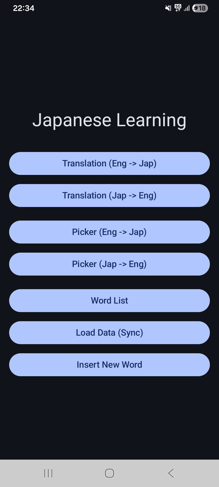
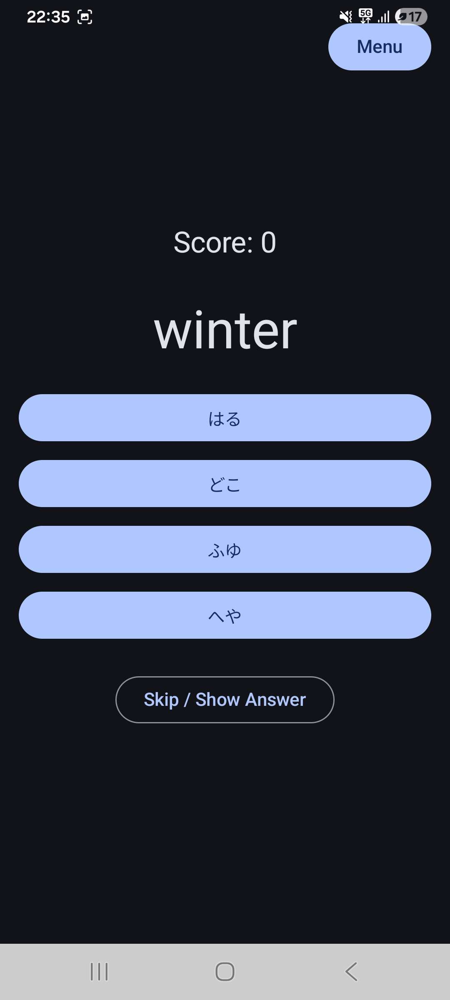

# 🎌 Japanese Guessing Game

An Android app for learning Japanese vocabulary through interactive quizzes. Words are fetched from a cloud database and users can practice translating between Japanese (hiragana) and English in two different game modes.

<div align="center">
  
</div>

## 🎮 Features

- **Two game modes** — Type your answer (Translation) or pick from multiple choices (Picker)
- **Two directions** — Japanese → English or English → Japanese
- **Live scoring** with correct/incorrect feedback
- **Skip** a word to reveal the answer and move on
- **Add new words** to the database directly from the app
- **Offline caching** — words are cached locally so the app works without a connection

<div align="center">
  
</div>

## 🛠️ Tech Stack

| Category | Tools |
|---|---|
| **Language** | [Kotlin](https://kotlinlang.org/) |
| **UI** | [Jetpack Compose](https://developer.android.com/jetpack/compose), [Material 3](https://m3.material.io/) |
| **Architecture** | MVVM (ViewModel + StateFlow) |
| **Backend / Database** | [Supabase](https://supabase.com/) (PostgreSQL via PostgREST + Realtime) |
| **Networking** | [Ktor](https://ktor.io/) (Android client) |
| **Async** | Kotlin Coroutines |
| **Navigation** | Jetpack Navigation Compose |
| **Build** | Gradle (Kotlin DSL), Android SDK 35, min SDK 24 |

## 🚀 Getting Started

### Prerequisites
- Android Studio
- A [Supabase](https://supabase.com/) project with a `words` table containing `hiragana`, `meaning_1`, and `meaning_2` columns

### Setup
1. Clone the repository
2. Add your Supabase credentials to the project (URL and anon key)
3. Open in Android Studio and run on a device or emulator (Android 7.0+)

## 📁 Project Structure
```
app/src/main/java/com/example/japanese_guessing_game/
├── MainActivity.kt # Entry point, Compose navigation host
├── MainViewModel.kt # Game logic, state management
├── data/ # Data models, repository, Supabase client
└── ui/
└── theme/ # Material 3 theme
```